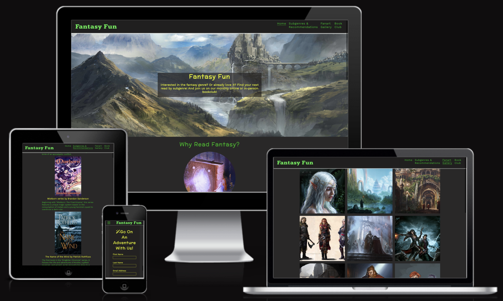

---

# **FANTASY FUN**

The Fantasy Fun wesbite is for people who wish to dip their toes into the fantasy genre as their first foray, as well as for people who are seasoned readers of the genre but wish to get recommendations for their next read. The website also provides platform for a book club community that like-minded readers can join either online or in-person to discuss and share their love, thoughts, and opinions of books belonging to the genre.

The website can be accessed by this [link](https://marcgithub23.github.io/pp1-fantasy-fun/)

---

## USER STORIES

### As a user:

- I want to immediately understand the purpose of the website without difficulty and find out information about the fantasy genre.
- I want to easily navigate around the website and quickly get to sections where I can find the relevant information I want.
- I want to find a list of recommendations by subgenres as well as a little bit of description about the recommended books.
- I want to see fanart inspired by the fantasy genre so that it inspires me to read more books beloning to the genre.
- I want to find the details of the book club and how to join it, as well as find links to social media accounts so I can delve deeper into the community.