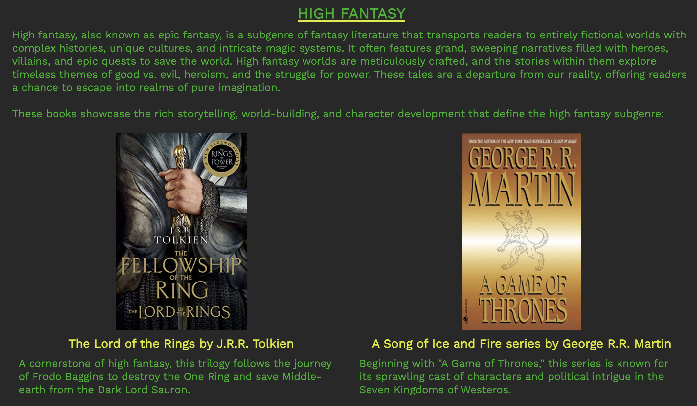

---

# **FANTASY FUN**

The Fantasy Fun wesbite is for people who wish to dip their toes into the fantasy genre as their first foray, as well as for people who are seasoned readers of the genre but wish to get recommendations for their next read. The website also provides platform for a book club community that like-minded readers can join either online or in-person to discuss and share their love, thoughts, and opinions of books belonging to the genre.

The website can be accessed by this [link](https://marcgithub23.github.io/pp1-fantasy-fun/)

---

## USER STORIES

### As a user:

- I want to immediately understand the purpose of the website without difficulty and find out information about the fantasy genre.
- I want to easily navigate around the website and quickly get to sections where I can find the relevant information I want.
- I want to find a list of recommendations by subgenres as well as a little bit of description about the recommended books.
- I want to see fanart inspired by the fantasy genre so that it inspires me to read more books beloning to the genre.
- I want to find the details of the book club and how to join it, as well as find links to social media accounts so I can delve deeper into the community.

## Features

### Navigation Bar

#### On phone devices:

- The navigation bar is located on top with a toggle button on the left, which when pressed gives a dropdown menu to navigate to other pages.
- The logo is located on the right, which when pressed links back to the home page.
- An underline denotes the current page on the screen.

#### On tablet devices:

- The navigation bar is located on top with the logo on the left, which when pressed links back to the home page.
- Links to other pages are on the right.
- An underline denotes the current page on the screen.

#### On laptop and desktop large devices:

- The navigation bar is located on top with the logo on the left, which when pressed lunks back to the home page.
- Links to other pages are on the right.
- An underline denotes the current page on the screen.
- An underline appears when the cursor hovers on a link to another page other than the current page on the screen.

---

### Home Page

#### Hero Section

- The hero section contains a background image.
- There is a cover text in the centre, which includes the name of the website and a call to action for users to find their next read and joing the monthly online or in-person book club.

#### Reasons Section

- The reasons section contains 5 reasons to entice users to read fantasy.

#### Information Section

- The information section gives a brief history of the genre, as well as some statistics to give users informational background to further encourage them to read fantasy.

#### Quote Section

- A small section cites and quotes an author about fantasy, a feature that will further encourage users to read fantasy.

#### Footer

- The footer contains link icons to social media: Facebook, Twitter, Instagram, and Discord.
- On laptop or desktop devices, the link icons turn yellow when hovered on. Therefore, it is interactive.
- It also contains copyright and disclaimer about educational purposes only.

---

### Subgenres & Recommendations Page

- The Subgenres & Recommendations page provides a brief description of the following 7 subgenres: High fantasy, Low fantasy, Grimdark fantasy, Portal fantasy, Urban fantasy, Steampunk fantasy, and Fairy-tale retelling fantasy.
- The page also recommends 6 titles for each subgenre, which includes the author and a small blurb about the book.
- On phone and tablet devices, the book titles are listed one below the other. But on laptop or desktop devices, they are listed in a 2-column layout to make use of space. Therefore, it is responsive.
- The page also contains a small section that cites and quotes an author about fantasy, a feature that will further encourage users to read fantasy.

---

### Fanart Gallery Page

- The Fanart Gallery page contains a total of 12 fanart images that depict fantastical settings and characters, which will give users a glimpse of the world of fantasy fiction.
- On phone devices, the images are displayed in one column. On tablet devives, the images are displayed in two columns. On laptop or desktop devices the images are displayed in three columns. Therefore, it is responsive.
- The page also contains a small section that cites and quotes an author about escapism, which ties in with one of the reasons for reading fantasy on the home page.

---

### Book Club Page

#### Book Club Description

- The book club page contains a description of the book club inviting users to join the book club; a call to action.
- It also provides information on what book the club is reading for the next meet-up.

#### Meet-up Section

- The meet-up section contains information on the date, time, and location of the online and in-person book club.
- The location of the in-person meet-up is provided on Google Maps, which is embedded on the page.
- On laptop or desktop devices, the link icon to join the Discord server is customised so that it turns yellow when hovered on. Therefore, it is interactive.

#### Book Club Rules

- A section outlines 10 rules members must abide, which informs users who may potentionally sign up.

#### Sign Up Form

- A customised form allows users to sign up for the book club.
- All inputs are set as required to complete and submit the form.
- On laptop or desktop devices, the input fields turn green when hovered on for interactivity. Similarly, the join button changes colour as well.
- When clicking the join button, it leads to the response page.
- The page also contains a small section that cites and quotes a poet's poem about folklore fairies.

---

### Response Page

- The response page appears when clicking the join button from the book club page.
- It thanks the user for joining, and informs them that they will be contacted within the next 24 hours with more details.
- After 10 seconds, it will redirect back to the home page.

---

## Technologies Used

- [HTML](https://developer.mozilla.org/en-US/docs/Web/HTML) was used to build the foundation of this website.
- [CSS](https://developer.mozilla.org/en-US/docs/Web/css) was used to format and style the website.
- [CSS Flexbox](https://developer.mozilla.org/en-US/docs/Learn/CSS/CSS_layout/Flexbox) was used to organise the items symmetrically on the website.
- [Canva](https://www.canva.com/) was used to create wireframes for the website.
- [VSCode](https://code.visualstudio.com/) was used as the main tool to write and edit code.
- [Git](https://git-scm.com/) was used for the version control of this website.
- [GitHub](https://github.com/) was used to host the code of this website.
- [TinyPNG](https://tinypng.com/) was used to optimise images for the website.

---

## Design

### Colour Scheme

- Black was used as the primary colour (60%) to evoke a dark, mysterious atmosphere often depicted in fantasy.
- Green was used as the secondary colour (30%) to emulate an enchanted forest.
- Gold was used as the accent colour (10%) to remind users of a treasure trove of golden loots.