# TESTING

## Compatibility

The website was tested on Google Chrome and Safari web browsers to check functionality, responsiveness, and appearance.

## Responsiveness

The website was inspected using devtools to check its responsiveness, for example, the Fanart Gallery page increases in column number as the screen size gets bigger.

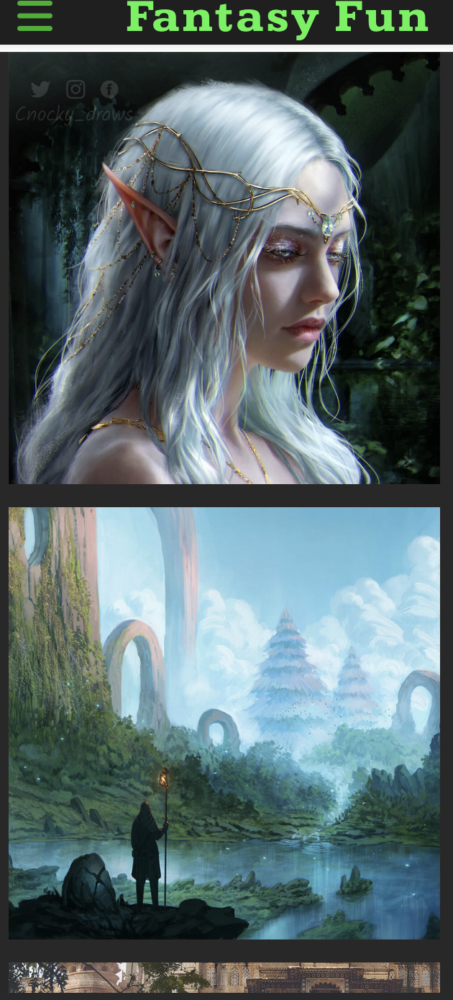

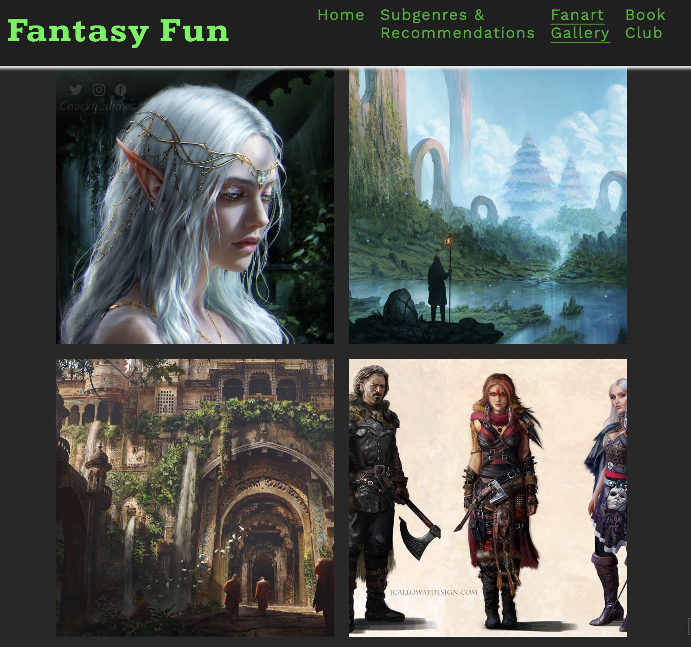

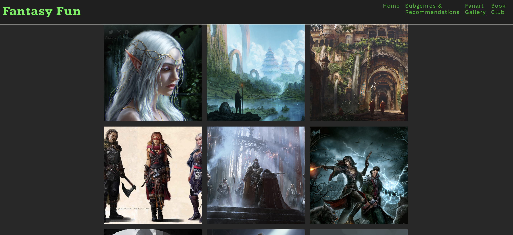

Additionally, the website's responsiveness on different devices has been tested using a Google Chrome extension called [Responsive Viewer](https://chrome.google.com/webstore/detail/responsive-viewer/inmopeiepgfljkpkidclfgbgbmfcennb). The following devices were selected for testing:

- Galaxy S9, Note 8, S8 (360 x 740)
- iPhone 6/7/8 Plus (414 x 736)
- iPad (768 x 1024)
- Kindle Fire HDX (800 x 1280)
- Laptop (1280 x 800)

A [pdf](documentation/responsiveness-different-devices.pdf) generated by using a Google Chrome extension called [GoFullPage](https://chrome.google.com/webstore/detail/gofullpage-full-page-scre/fdpohaocaechififmbbbbbknoalclacl) is available.

## Manual Testing

| Feature | Action | Expected Result | Tested | Passed | Comments |
| --- | --- | --- | --- | --- | --- |
| Navbar | Scroll down the page | Navbar stays fixed | Yes | Yes | None |
| Navbar toggle | Press on toggle button | Navbar dropdown menu appears | Yes | Yes | None |
| Home link | Click on the "Home" link | The user is redirected to the main page | Yes | Yes | None |
| Subgenres & Recommendations link | Click on the "Subgenres & Recommendations" link | The user is redirected to the Subgenres & Recommendations page | Yes | Yes | None |
| Fanart Gallery link | Click on the "Fanart Gallery" link | The user is redirected to the Fanart Gallery page | Yes | Yes | None |
| Book Club link | Click on the "Book Club" link | The user is redirected to the Book Club page | Yes | Yes | None |
| Footer | Click on each link icon | The user is redirected to the corresponding page on a new tab | Yes | Yes | None |
| Subgenres & Recommendations page | Switch from phone or tablet screen size to laptop or desktop screen size | The layout changes to a 2-column format | Yes | Yes | Makes use of extra space |
| Fanart Gallery page | Switch between phone, tablet, and laptop or desktop screen sizes | The number of column increases | Yes | Yes | Makes use of extra space |
| Sign up form on Book Club page | Complete all required fields | An error message appears if one of the fields are left out. The email address field also displays an error message if a non-valid email address is typed. Clicking the join button redirects to the response page | Yes | Yes | Validates data |
| Links interactivity | Hover on cursor on links | On laptop or desktop devices, an underline appears underneath navbar menu links when hovered on. Footer link icons, sign up form input fields, and join button change colour when hovered on | Yes | Yes | Makes website responsive and interactive |
| Response page | The user will be automatically redirected to the home page after 10 seconds | The user is redirected to the home page | Yes | Yes | None |

---

## Validator Testing

### HTML

No errors or warnings were found when passing through the official W3C validator.

#### Home page

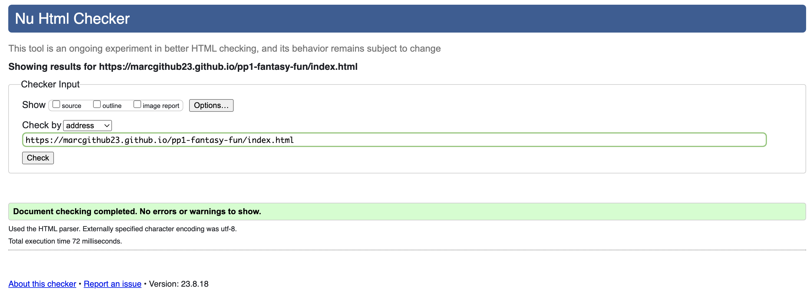

#### Subgenres & Recommendations page

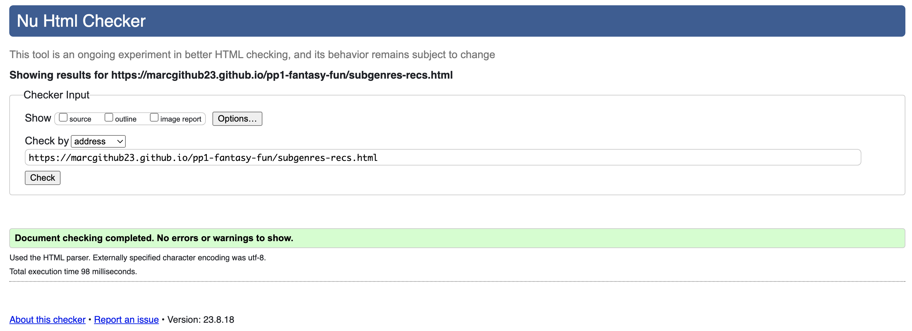

#### Fanart Gallery page

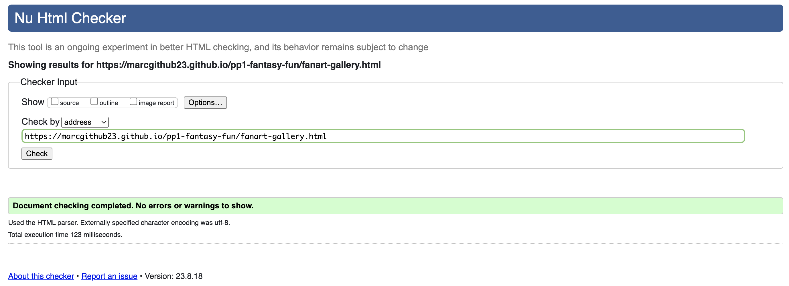

#### Book Club page

#### Response page

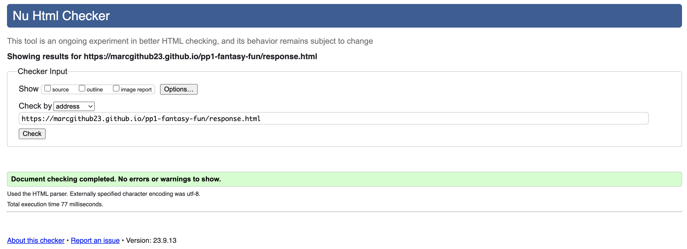

### CSS

No errors or warnings were found when passing through the official W3C validator.

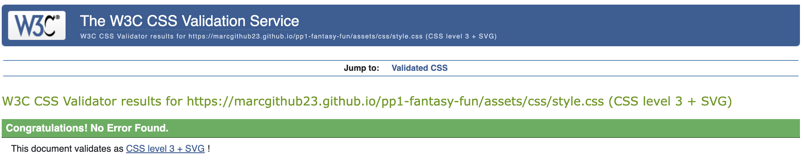

### Lighthouse report

- Lighthouse in devtools checks that the website scores high in performance, accessbility, best practices, and SEO.
- The reponse page has lower accessbility score due to the page being redirected to the home page after 10 seconds. However, it has been tested that 10 seconds is ample time to read the response message at a low reading spead.

#### Home page

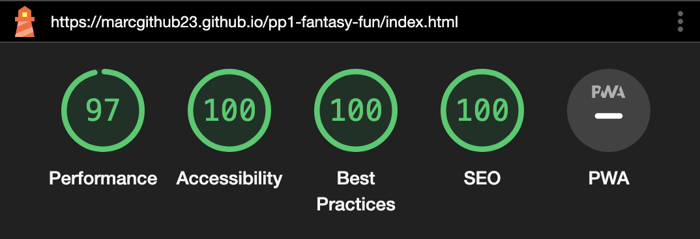

#### Subgenres & Recommendations page

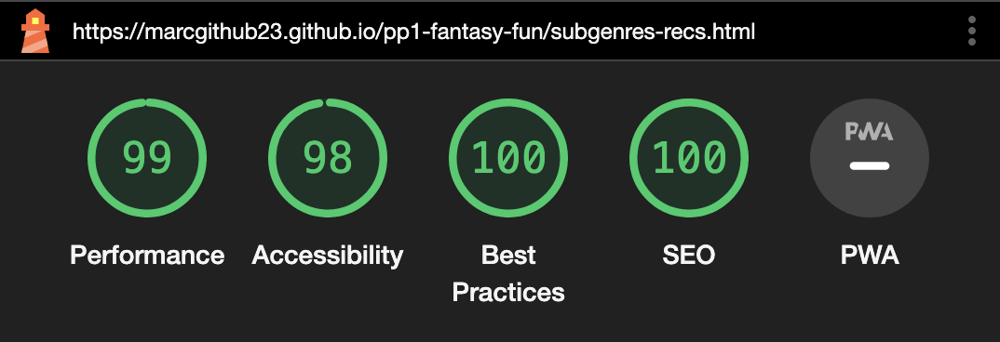

#### Fanart Gallery page

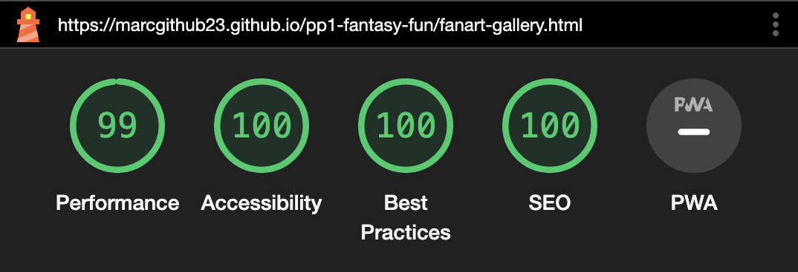

#### Book Club page

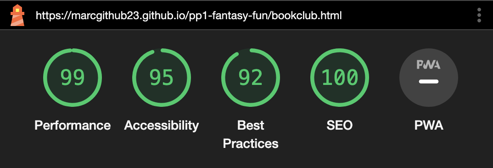

#### Response page

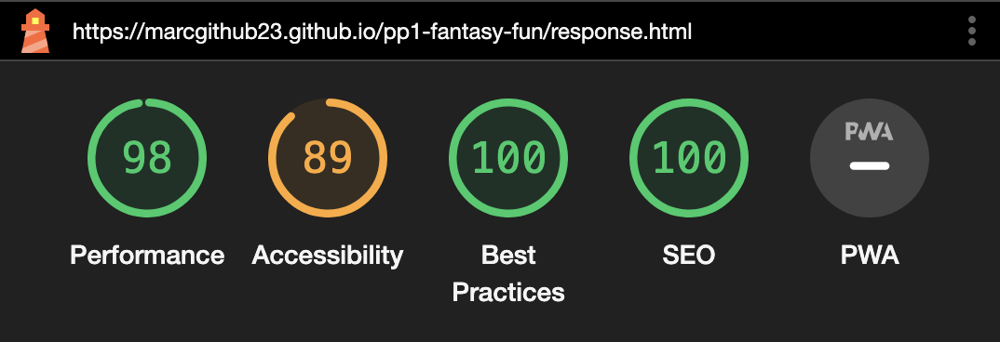

---

## Bugs

### Solved bugs:

- The logo split into two lines on tablet screens. This was solved by editing the menu and logo to fit the header on tablet screens using CSS.
- The logo covered the h2 on Book Club page on tablet screens. This was solved by moving the h2 out of div and putting it under section in the HTML file.
- During the initial HTML validation, the quote sections on each web page and the response section lacked heading. This was solved by adding h2 and hiding it using a CSS style class selector.

### Unsolved bugs:

- There are no known bugs at the time of submission of this project.